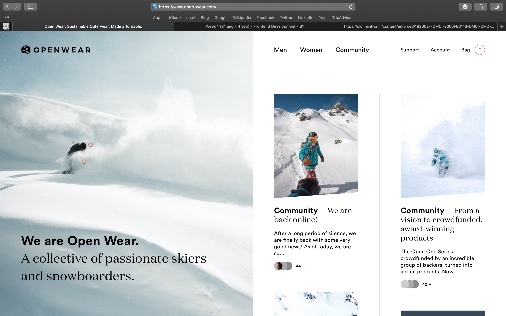

# Procesverslag
**Auteur:** Gitta Schermer
**Jaar:** 2020
**Docent:** Vasilis van Gemert

Markdown cheat cheet: [Hulp bij het schrijven van Markdown](https://github.com/adam-p/markdown-here/wiki/Markdown-Cheatsheet). Nb. de standaardstructuur en de spartaanse opmaak zijn helemaal prima. Het gaat om de inhoud van je procesverslag. Besteedt de tijd voor pracht en praal aan je website.

## Bronnenlijst
1. https://www.open-wear.com/?v=796834e7a283
2. https://stackoverflow.com/questions/11915826/image-not-showing-up-in-readme-md-on-github
3. -...-

## Eindgesprek (week 7/8)

-dit ging goed & dit was lastig-

**Screenshot(s):**

-screenshot(s) van je eindresultaat-

## Voortgang 3 (week 6)

-same as voortgang 1-

## Voortgang 2 (week 5)

-same as voortgang 1-

## Voortgang 1 (week 3)

### Stand van zaken

-dit ging goed & dit was lastig-

**Screenshot(s):**

-screenshot(s) van hoe ver je bent-

### Agenda voor meeting

-samen met je groepje opstellen-

### Verslag van meeting

-na afloop snel uitkomsten vastleggen-

## Intake (week 1)

**Je startniveau:** -Blauwe piste-

**Je focus:** -Keuze voor surface plane-

**Je opdracht:** https://www.open-wear.com/

**Screenshot(s):**

**Breakdown-schets(en):**

